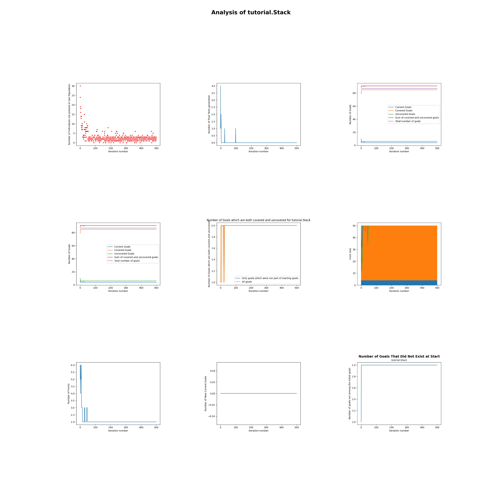

# Project README

# Observability Dashboard for EvoSuite

## Table of Contents

- [Overview](#overview)
- [Quick Start Demo](#quick-start-demo)
- [Features](#features)
  - [EvoSuite Visualizer](#evosuite-visualizer)
  - [EvoSuite Logger](#evosuite-logger)
- [Project Structure](#project-structure)
- [Installation](#installation)
  - [Prerequisites](#prerequisites)
    - [Prerequisites for EvoSuite Visualize](#prerequisites-for-visualization-tool)
    - [Prerequisites for EvoSuite Logger](#prerequisites-for-log-generation-tool)
  - [Setup](#setup)
    - [Setup for EvoSuite Visualizer](#setup-for-visualization-tool)
    - [Setup for EvoSuite Logger](#setup-for-log-generation-tool)
- [Usage](#usage)
  - [Visualization Tool Usage](#visualization-tool-usage)
  - [Log Generation Tool Usage](#log-generation-tool-usage)
- [Configuration](#configuration)
  - [Configuration for Visualization Tool](#configuration-for-visualization-tool)
  - [Configuration for Log Generation Tool](#configuration-for-log-generation-tool)
- [Examples](#examples)
  - [Generating Visualizations](#generating-visualizations)
  - [Creating Log Files](#creating-log-files)
- [Output](#output)
  - [Visualization Outputs](#visualization-outputs)
  - [Log File Format](#log-file-format)
- [Future Work](#future-work)
- [License](#license)
- [Acknowledgments](#acknowledgments)

## Overview

The Observability Dashboard for EvoSuite is designed to enhance the transparency of EvoSuite's test generation process through two distinct tools:

**EvoSuite Visualizer**: This tool processes log data obtained by the EvoSuite Logger and generates visualizations to provide insights into the runtime behavior of EvoSuite. It is particularly useful for analyzing test generation patterns and coverage progress in a convenient and easy way.

**EvoSuite Logger**: Hosted on a separate GitHub repository ([GitHub Link](https://github.com/DominikFischli/evosuite.git)), this tool generates detailed logs during the execution of EvoSuite. While it can be run independently, this project includes a convenient script to simplify its use.

These tools work together to support academic research and practical analysis, offering a comprehensive view of EvoSuite's operation and enabling users to better understand and improve its behavior. The EvoSuite Visualizer can only parse logs created by the EvoSuite Logger, so naturally, the tools are designed to first run the logger and then feed its output to the visualizer. However, the logs obtained by the logger could be repurposed for different tasks, such as integration into other coding projects.


## Quick Start Demo

### Prerequisites

To run the demo, ensure Docker is installed on your system. All other dependencies, including Java, Maven, Python, and necessary libraries, are managed within the Docker environment.

### Running the Demo

#### 1. Clone the GitHub Repository

Start by cloning the repository. Open your terminal and execute the following commands:

```bash
git clone https://github.com/J-Mauerhofer/observability_dashboard_dockerized.git
cd observability_dashboard_dockerized
```

#### 2. Build the Docker Image

Build the Docker image using the provided `Dockerfile`:

```bash
docker build -t evosuite-tool .
```

This command creates a Docker image named `evosuite-tool`.

#### 3. Obtain the Tutorial Stack Project

The Tutorial Stack project is required for the demo. Follow these steps to download it:

Navigate up one directory:

```bash
cd ..
```

##### For macOS and Linux:

```bash
wget http://evosuite.org/files/tutorial/Tutorial_Stack.zip
unzip Tutorial_Stack.zip
```

##### For Windows:

Copy and paste the following link into your web browser's address bar to download the project:

```
http://evosuite.org/files/tutorial/Tutorial_Stack.zip
```

Make sure to place it in the same directory as the `observability_dashboard_dockerized`


#### 4. Compile the Tutorial Stack Project

Navigate back to the base directory of `observability_dashboard_dockerized` and compile the Tutorial Stack project using Docker:

```bash
cd observability_dashboard_dockerized
docker run -v "$(pwd)/../Tutorial_Stack/Tutorial_Stack:/tutorial-stack-project" -w /tutorial-stack-project evosuite-tool mvn compile
```

#### 5. Execute the Program

With the setup complete, use the examples below to run the observability dashboard for EvoSuite. Replace placeholder paths with your own absolute paths where necessary.

**Example 1: Generate Log Files**

To generate log files, execute the following command:

```bash
docker run --rm -it -v "ABSOLUTE_PATH_TO_TUTORIAL_STACK_PROJECT_BASE_DIRECTORY:/mnt/project-base-dir" evosuite-tool python3 scripts/log_generation/EvosuiteLogger.py "/mnt/project-base-dir" -class tutorial.Stack -projectCP target/classes -Dsearch_budget=60
```

This command mounts the specified path into the container and runs the `EvosuiteLogger.py` script to generate log files. Replace `ABSOLUTE_PATH_TO_TUTORIAL_STACK_PROJECT_BASE_DIRECTORY` with the absolute path to your `Tutorial_Stack` directory.
The process should take exactly 60 seconds.

**Example 2: Generate Visualizations**

To generate visualizations, specify the absolute path to the directory containing the log files (e.g., `Tutorial_Stack/LogFiles_EvoSuiteLogger`) and run the following command:

```bash
docker run --rm -it -v "ABSOLUTE_PATH_TO_LOG_FILES_DIRECTORY:/mnt/log-files-dir" evosuite-tool python3 scripts/visualization/EvosuiteVisualizer.py --input_directory "/mnt/log-files-dir"
```

This command mounts the log files directory into the container and runs the `EvosuiteVisualizer.py` script to create visualizations. Replace `ABSOLUTE_PATH_TO_LOG_FILES_DIRECTORY` with the correct path to your log files directory.
This process should take no more than 2 minutes.

---

The visualizations have now been successfully generated! They can be found in the directory `\LogFiles_EvoSuiteLogger\visualization` within the Tutorial Stack project directory.

Below is an example of the visualizations you can expect (please note that your results may vary depending on the seed used):



By leveraging Docker, this setup ensures a consistent and dependency-free environment across all systems, simplifying the process and enhancing reliability.


## Features

### Evosuite Visualizer

The EvoSuite Visualizer processes log files generated during the EvoSuite testing process and creates insightful visualizations. Key features include:

* Support for a wide variety of visualization types, offering comprehensive insights into the test generation process.

* Users can generate PDF files from the visualizations with options for customization. They can select specific visualizations to include and choose between various layouts, providing flexibility for creating overviews of classes or extracting tailored visualizations for academic presentations or reports.

* Flexibility in use by allowing users to specify program arguments via the command line, utilize a configuration file for streamlined setup, or rely on default hardcoded settings as a fallback. 

* Parallel processing to handle large log files efficiently.

### EvoSuite Logger

[PLACEHOLDER: Describe the key features of the EvoSuite Logger. Highlight its role in capturing detailed information about test generation processes, and explain what kind of logs it produces.]

## Project Structure

### scripts

**visualization**: Contains the visualization tool script (run_visualizations.py). This script serves as the entry point to the EvoSuite Visualizer, allowing users to generate visualizations from log files. A default configuration file (visualization_config.json) is provided for convenience and can be edited to customize the tool's behavior.

**log_generation**: Contains the EvoSuite Logger script (create_logs.py). This folder also includes a default configuration file (logging_config.json) to streamline setup and customization.

### src

**DynaMOSA_Model**: Contains an object-oriented reconstruction of the log files, which serves as the foundation of the program. The visualizations are created based on the structured data in this model.

**Visualizations**: Includes the Plots and VisualizationScripts subdirectories, which house individual plot implementations and scripts combining these plots into cohesive visualizations. Users are not expected to interact with this folder directly.

**example_logs**: Contains example log files that can be used with the EvoSuite Visualizer. These logs allow users to experiment with the visualizer, even if they do not have their own log files yet.

## Installation

### Prerequisites

#### Prerequisites for EvoSuite Visualizer

[PLACEHOLDER: List the system requirements and dependencies needed to run the visualization tool. Mention specific versions of Python or libraries, if applicable.]

#### Prerequisites for EvoSuite Logger

[PLACEHOLDER: List the system requirements and dependencies needed to run the log generation tool. Mention any unique dependencies or requirements for this tool.]

### Setup

#### Setup for EvoSuite Visualizer

The EvoSuite Visualizer is ready to use immediately after cloning the GitHub repository. To use it, simply run the run_visualizations.py script and pass it paramters or use alternative methods of communicating with the script as described in the usage section. 

#### Setup for EvoSuite Logger

[PLACEHOLDER: Provide step-by-step instructions for setting up the log generation tool. Include any additional setup steps specific to this tool.]

## Usage

### EvoSuite Visualizer Usage

To use the visualization tool, run the run_visualizations.py script with the required parameters.

The script requires parameters, listed below, to be select ed before each execution. If a parameter is passed as a command-line argument, it will take precedence. If it is not provided in the command line, the script checks if a configuration file is specified and tries to retrieve the parameter from there. If neither an argument nor a configuration file entry is available, the script falls back to hardcoded default values. This approach ensures maximum ease of use and flexibility.

#### Parameters:

* **--input_directory**: Absolute path to the directory containing log files.

* **--output_directory**: Absolute path where visualizations will be saved.

* **--plots**: Specify plots to generate (e.g., new_individuals,final_tests) or use all.

* **--strategy**: Visualization strategy (sequential or consolidated).

* **--output_filename**: Name of the output PDF file (e.g., visualization.pdf). Automatically ensures uniqueness.

* **--max_workers**: Maximum number of threads for parallel processing (default: 1).

* **--timeout**: Timeout for each plot in seconds (default: 60).

* **--config**: Path to a JSON configuration file or use default for the predefined configuration file.

#### Example commands:

**Basic Command**:
```bash
python run_visualizations.py --input_directory /path/to/logs --output_directory /path/to/results
```

**Custom Output Filename**:
```bash
python run_visualizations.py --input_directory /path/to/logs --output_filename custom_visualization.pdf
```

### Log Generation Tool Usage

[PLACEHOLDER: Provide step-by-step instructions for using the log generation tool. Include example commands, explain any required inputs, and describe the output logs.]

## Configuration

### Configuration for Visualization Tool

The visualization tool can be used with a JSON configuration file to specify parameters, so that they dont have to be typed out in the command line for every execution of the program. The parameters in the configuration file will still be overwritten if the same parameters are also passen in the command line. The default configuration file is located at:

`/scripts/visualization/visualization_config.json`

It is intended that users can edit the contents of the default configuration file and adjust it to their preferences.

if users would like to use the default configuration file, they need to pass "default" to the --config parameter like this:
```bash
python run_visualizations.py --config default
```

Users can also create additional configuration files. For this, they just need to create a new JSON file and specify its path with the --config option:

```bash
python run_visualizations.py --config /path/to/custom_config.json
```

### Configuration for Log Generation Tool

[PLACEHOLDER: Explain the purpose of the configuration file for the log generation tool. Describe its default location and parameters, and provide examples of how users can modify it.]

## Examples

### Generating Visualizations

**Basic Example**: Generate all available visualizations from a log directory:
```bash
python run_visualizations.py --input_directory /path/to/logs --output_directory /path/to/results
```

**Custom Example**: Generate specific visualizations with a custom output filename:
```bash
python run_visualizations.py --input_directory /path/to/logs --plots new_individuals,final_tests --output_filename analysis.pdf
```

### Creating Log Files

[PLACEHOLDER: Walk through a concrete example of generating log files using the log generation tool. Include a realistic example command, describe the input, and show the resulting log file.]

## Output

### EvoSuite Visualizer Outputs

The visualizations are saved as PDF files in the specified output directory. 

### EvoSuite Logger Outputs

[PLACEHOLDER: Describe the format of the logs generated by the log generation tool. Include an example log file and explain its structure and key components.]

## Acknowledgments

The Observability Toolsuite for EvoSuite was developed by both Dominik Fischli and Julian Mauerhofer