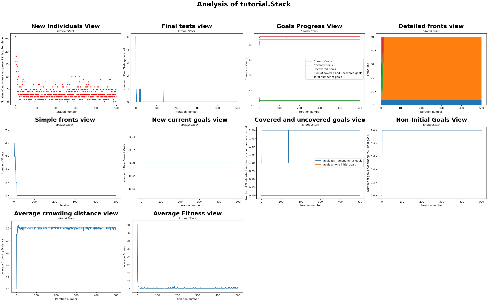

# Project README

# Observability Dashboard for EvoSuite

## Table of Contents

- [Overview](#overview)
- [Quick Start Demo](#quick-start-demo)
- [Features](#features)
  - [EvoSuite Visualizer](#evosuite-visualizer)
  - [EvoSuite Logger](#evosuite-logger)
- [Project Structure](#project-structure)
- [Installation](#installation)
  - [Prerequisites](#prerequisites)
    - [Prerequisites for EvoSuite Visualize](#prerequisites-for-visualization-tool)
    - [Prerequisites for EvoSuite Logger](#prerequisites-for-log-generation-tool)
  - [Setup](#setup)
    - [Setup for EvoSuite Visualizer](#setup-for-visualization-tool)
    - [Setup for EvoSuite Logger](#setup-for-log-generation-tool)
- [Usage](#usage)
  - [Visualization Tool Usage](#visualization-tool-usage)
  - [Log Generation Tool Usage](#log-generation-tool-usage)
- [Configuration](#configuration)
  - [Configuration for Visualization Tool](#configuration-for-visualization-tool)
  - [Configuration for Log Generation Tool](#configuration-for-log-generation-tool)
- [Examples](#examples)
  - [Generating Visualizations](#generating-visualizations)
  - [Creating Log Files](#creating-log-files)
- [Output](#output)
  - [Visualization Outputs](#visualization-outputs)
  - [Log File Format](#log-file-format)
- [Future Work](#future-work)
- [License](#license)
- [Acknowledgments](#acknowledgments)

## Overview

The Observability Dashboard for EvoSuite is designed to enhance the transparency of EvoSuite's test generation process through two distinct tools:

**EvoSuite Logger**: This tool, with its source code hosted in a separate ([GitHub Link](https://github.com/DominikFischli/evosuite.git)), generates detailed logs during EvoSuite executions. While it can be used independently, this project provides a convenient script and its .jar file, eliminating the need for users to access the separate repository hosting its source code.

**EvoSuite Visualizer**: This tool processes log data obtained by the EvoSuite Logger and generates visualizations to provide insights into the runtime behavior of EvoSuite. It is particularly useful for analyzing test generation patterns and coverage progress in a convenient and easy way.

These tools work together to support academic research and practical analysis, offering a comprehensive view of EvoSuite's operation and enabling users to better understand and improve its behavior. The EvoSuite Visualizer can only parse logs created by the EvoSuite Logger, so naturally, the tools are designed to first run the logger and then feed its output to the visualizer. However, the logs obtained by the logger could be repurposed for different tasks, such as integration into other coding projects.


## Quick Start Demo

### Prerequisites

To run the demo, ensure Docker is installed and running on your system. All other dependencies, including Java, Maven, Python, and necessary libraries, are managed within the Docker environment.

### Running the Demo

#### 1. Clone the GitHub Repository

Start by cloning the repository. Open your terminal and execute the following commands:

```bash
git clone https://github.com/J-Mauerhofer/observability_dashboard_dockerized.git
cd observability_dashboard_dockerized
```

#### 2. Build the Docker Image

Make sure Docker is installed and running, and that you have the necessary permissions to build the image.

Build the Docker image using the provided `Dockerfile`. 

```bash
docker build -t evosuite-tool .
```

This command creates a Docker image named `evosuite-tool`.


#### 3. Obtain the Tutorial Stack Project

The Tutorial Stack project is required for the demo. Follow these steps to download it:

Navigate up one directory:

```bash
cd ..
```


##### If you have curl installed (this comes preinstalled with most new operating systems):

##### For macOS and Linux:

```bash
curl -L -O http://evosuite.org/files/tutorial/Tutorial_Stack.zip
unzip Tutorial_Stack.zip
```

##### For Windows (10 or newer):

```bash
Invoke-WebRequest -Uri "http://evosuite.org/files/tutorial/Tutorial_Stack.zip" -OutFile "Tutorial_Stack.zip"
Expand-Archive -Path "Tutorial_Stack.zip" -DestinationPath .
```

##### If you DO NOT have curl installed or anything else went wrong:

Copy and paste the following link into your web browser's address bar to download the project:

```
http://evosuite.org/files/tutorial/Tutorial_Stack.zip
```

Manually unzip the project.


#### 4. Compile the Tutorial Stack Project

Compile the Tutorial Stack project by using maven which is included in our docker container. In the command below, replace

```bash
'/ABSOLUTE/PATH/TO/Tutorial_Stack/Tutorial_Stack'
```

with the actual path to the base directory of the tutorial stack project. Then, run this command to compile the Tutorial Stack project:


```bash
docker run -v "/ABSOLUTE/PATH/TO/Tutorial_Stack/Tutorial_Stack:/tutorial-stack-project" -w /tutorial-stack-project evosuite-tool mvn compile

```

As with all docker commands, make sure Docker is installed and running, and that you have the necessary permissions to run this command.


#### 5. Execute the Program

With the setup complete, use the examples below to run the observability dashboard for EvoSuite. Replace placeholder paths with your own absolute paths where necessary.

**Example 1: Generate Log Files**


The command below mounts the specified path into the container and runs the `EvosuiteLogger.py` script to generate log files. Replace
```bash
`ABSOLUTE_PATH_TO_TUTORIAL_STACK_PROJECT_BASE_DIRECTORY`
```
with the absolute path to the base directory of your `Tutorial_Stack` project.
The process should take exactly 60 seconds.

Now to generate log files, replace the placeholder path with your actual absolute path and execute the following command:

```bash
docker run --rm -it -v "ABSOLUTE_PATH_TO_TUTORIAL_STACK_PROJECT_BASE_DIRECTORY:/mnt/project-base-dir" evosuite-tool python3 scripts/log_generation/EvosuiteLogger.py "/mnt/project-base-dir" -class tutorial.Stack -projectCP target/classes -Dsearch_budget=60
```
As with all docker commands, make sure Docker is installed and running, and that you have the necessary permissions to run this command.


**Example 2: Generate Visualizations**

To generate visualizations, specify the absolute path to the directory containing the log files (e.g., `Tutorial_Stack/LogFiles_EvoSuiteLogger`) and run the following command:

```bash
docker run --rm -it -v "ABSOLUTE_PATH_TO_LOG_FILES_DIRECTORY:/mnt/log-files-dir" evosuite-tool python3 scripts/visualization/EvosuiteVisualizer.py --input_directory "/mnt/log-files-dir"
```

This command mounts the log files directory into the container and runs the `EvosuiteVisualizer.py` script to create visualizations. Replace 
```bash
`ABSOLUTE_PATH_TO_LOG_FILES_DIRECTORY`
```
with the absolute path to your log files directory.
This process should take no more than 2 minutes.

As with all docker commands, make sure Docker is installed and running, and that you have the necessary permissions to run this command.

---


The visualizations have now been successfully generated! They can be found as pdf's in the directory `\LogFiles_EvoSuiteLogger\visualization` within the Tutorial Stack project directory.

Below is an example of the visualizations you can expect (please note that your results may vary depending on the seed used):



By leveraging Docker, this setup ensures a consistent and dependency-free environment across all systems, simplifying the process and enhancing reliability.


## Features

### Evosuite Visualizer

The EvoSuite Visualizer processes log files generated during the EvoSuite test generation process and creates insightful visualizations. Key features include:

* Support for a wide variety of visualization types, offering comprehensive insights into the test generation process.

* Users can generate PDF files from the visualizations with options for customization. They can select specific visualizations to include and choose between various layouts, providing flexibility for creating overviews of classes or extracting tailored visualizations for academic presentations or reports.

* Flexibility in use by allowing users to specify program arguments via the command line, utilize a configuration file for streamlined setup, or rely on default hardcoded settings as a fallback. 

* Parallel processing to handle large log files efficiently.

### EvoSuite Logger

[PLACEHOLDER: Describe the key features of the EvoSuite Logger. Highlight its role in capturing detailed information about test generation processes, and explain what kind of logs it produces.]

## Project Structure

### scripts

**log_generation**: Contains the EvoSuite Logger script (EvosuiteLogger.py). This folder also includes a default configuration file (logging_config.json) to streamline setup and customization.

**visualization**: Contains the visualization tool script (EvosuiteVisualizer.py). This script serves as the entry point to the EvoSuite Visualizer, allowing users to generate visualizations from log files. A default configuration file (visualization_config.json) is provided for convenience and can be edited to customize the tool's behavior.

### src

**DynaMOSA_Model**: Contains an object-oriented reconstruction of the log files, which serves as the foundation of the program. The visualizations are created based on the structured data in this model.

**Visualizations**: Includes the Plots and VisualizationScripts subdirectories, which house individual plot implementations and scripts combining these plots into cohesive visualizations. Users are not expected to interact with this folder directly.

**example_logs**: Contains example log files that can be used with the EvoSuite Visualizer. These logs allow users to experiment with the visualizer, even if they do not have their own log files yet.

## Installation

### Prerequisites

Both tools require Docker to be installed. For the EvoSuite Logger, the ability to compile Java projects is necessary. The provided Docker image already includes Maven, offering a convenient option for users. No additional setup is required.

### Setup

Setting up the EvoSuite Visualizer is straightforward: 

1. Install Docker Desktop.  
2. Install Maven or an other program to compile Java projects if you plan to use the EvoSuite Logger.  
3. Clone this repository.  
4. Build the Docker image.  

With these steps, the installation is complete.

## Usage

### EvoSuite Visualizer Usage

To use the visualization tool, execute the `EvoSuiteVisualizer.py` script with the required parameters using the Docker image. The tool provides real-time progress updates, so we recommend using the `-it` flag for the Docker container.

The general pattern for running the `EvoSuiteVisualizer.py` script with Docker is:  
`docker run [docker-flags] [docker-image] [command]`

Examples of how to run these commands are provided below.

The EvosuiteVisualizer.py script requires parameters, listed below, to be select ed before each execution. If a parameter is passed as a command-line argument, it will take precedence. If it is not provided in the command line, the script checks if a configuration file is specified and tries to retrieve the parameter from there. If neither an argument nor a configuration file entry is available, the script falls back to hardcoded default values. This approach ensures maximum ease of use and flexibility.

#### Parameters:

* **--input_directory**: Absolute path to the directory containing log files.

* **--output_directory**: Absolute path where visualizations will be saved.

* **--plots**: Specify plots to generate (e.g., new_individuals,final_tests) or use all.

* **--strategy**: Visualization strategy (sequential or consolidated).

* **--output_filename**: Name of the output PDF file (e.g., visualization.pdf). Automatically ensures uniqueness.

* **--max_workers**: Maximum number of threads for parallel processing (default: 1).

* **--timeout**: Timeout for each plot in seconds (default: 60).

* **--config**: Path to a JSON configuration file or use default for the predefined configuration file.

#### Example commands:

**Basic Command**:
```bash
docker run -it -v "absolute/path/to/logs:/app/logs" [docker-image] python3 scripts/visualization/EvosuiteVisualizer.py --input_directory "/app/logs" --strategy "sequential"
```

**Custom Output Filename**:
```bash
docker run -it -v "absolute/path/to/logs:/app/logs" [docker-image] python3 scripts/visualization/EvosuiteVisualizer.py --input_directory /app/logs --output_filename "custom_visualization.pdf"
```

**With Custom Configuration File**:

```bash
docker run -it -v "absolute/path/to/logs:/app/logs" -v "/path/to/config:/app/config" [docker-image] python3 scripts/visualization/EvosuiteVisualizer.py --input_directory "/app/logs" --config "/absolute/path/to/custom_config.json"
```


### EvoSuite Logger Usage

To use the EvoSuite Logger, execute the `EvosuiteLogger.py` script with the required parameters using the Docker image. The tool supports both direct command-line arguments and JSON configuration files for flexibility.

The general command pattern for running the `EvosuiteLogger.py` script with Docker is:
```bash
docker run [docker-flags] [docker-image] [command]
```

The script allows users to specify program parameters via command-line arguments. If not provided, it will attempt to retrieve these from a configuration file. If neither an argument nor a configuration file is available, the script uses default settings.

#### Parameters:

* **--projectRoot**: Absolute path to the root directory of the Java project.

* **--locations**: Specify class directories and the classes they contain.

* **--parameters**: Additional EvoSuite parameters (e.g., -criterion branch, -Dsearch_budget=60).

* **--config**: Path to a JSON configuration file (optional; use "default" for the predefined file).

* **--parallel**: Enable parallel processing with an optional number of processes (e.g., --parallel 4).

Example Commands:
Using Direct Command-Line Arguments:

```bash
docker run -it -v "absolute/path/to/project:/app/project" [docker-image] python3 scripts/log_generation/EvosuiteLogger.py --projectRoot "/app/project" --locations '{"path": "target/classes", "classes": ["tutorial.Stack"]}' --parameters '-criterion branch -Dsearch_budget=60'
```

Using a Configuration File:
```bash
docker run -it -v "absolute/path/to/project:/app/project" -v "absolute/path/to/config:/app/config" [docker-image] python3 scripts/log_generation/EvosuiteLogger.py --config "/app/config/logging_config.json"
```

Enabling Parallel Processing:

```bash
docker run -it -v "absolute/path/to/project:/app/project" [docker-image] python3 scripts/log_generation/EvosuiteLogger.py --projectRoot "/app/project" --locations '{"path": "target/classes", "classes": ["tutorial.Stack", "tutorial.Queue"]}' --parameters '-criterion branch' --parallel 4
```

## Configuration

### Configuration for Visualization Tool

The visualization tool can be used with a JSON configuration file to specify parameters, so that they dont have to be typed out in the command line for every execution of the program. The parameters in the configuration file will still be overwritten if the same parameters are also passen in the command line. The default configuration file is located at:

`/scripts/visualization/visualization_config.json`

It is intended that users can edit the contents of the default configuration file and adjust it to their preferences.

if users would like to use the default configuration file, they need to pass "default" to the --config parameter like this:
```bash
--config "default"
```

Users can also create additional configuration files. For this, they just need to create a new JSON file and specify its path with the --config option:

```bash
--config "/path/to/custom_config.json"
```

An example of a log file for the EvoSuite Visualizer can be seen in this repository in scripts/visualization/visualization_config

### Configuration for EvoSuite Logger

[PLACEHOLDER: Explain the purpose of the configuration file for the log generation tool. Describe its default location and parameters, and provide examples of how users can modify it.]

## Additional Example

**Custom Example**: Generate all available visualizations from a log directory:


## Output

### EvoSuite Visualizer Outputs

The visualizations are saved as PDF files in the specified output directory. 

### EvoSuite Logger Outputs

The modified version of EvoSuite produces structured, chronologically ordered log files that provide detailed insights into the test generation process, when Evosuite is using the DynaMOSA algorithm. The logs are primarily JSON-based, ensuring ease of parsing and integration with analysis tools.

Each log file systematically records the entire execution flow, beginning with the initial population, followed by iteration 0, iteration 1, and so forth, until test generation concludes. At each iteration, extensive data is captured to facilitate a deep understanding of EvoSuite’s runtime behavior.

The key components of the log include:

Test Goals

Complete list of goals for the analyzed class, including coverage status (covered/uncovered).
Goals dynamically selected as current goals at each iteration.

Final Test Suite: The set of test cases selected as the final output.

Iteration-Specific Data (Recorded for Each Iteration):
Initial Population: The first set of test cases before evolutionary processes begin.
Offspring Populations: Newly generated test cases per iteration via crossover and mutation.
Surviving Populations: The set of test cases that survives at an iteration
Archive: A record of high-quality test cases retained throughout the process.
Number of covered, uncovered, and current goals.
Structural organization of test cases into ranked fronts.
Crossover and Mutation Details
Fitness values assigned to test cases.

Supplementary Information:
Dependency graph of the analyzed class.


These logs serve as the primary data source for the Observability Dashboard, enabling visualization and in-depth analysis of EvoSuite’s runtime behavior. Example log files are provided in this repository.


## Acknowledgments

The Observability Toolsuite for EvoSuite was developed by both Dominik Fischli and Julian Mauerhofer
